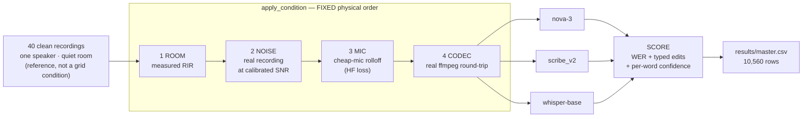
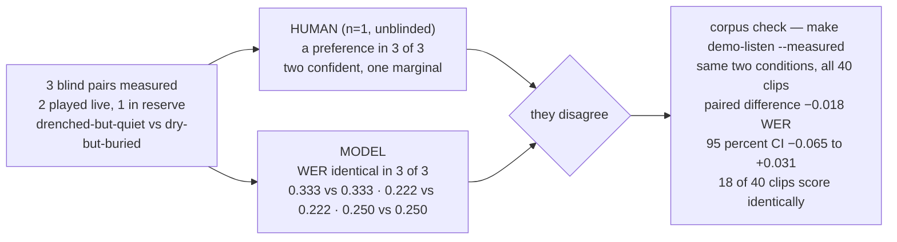
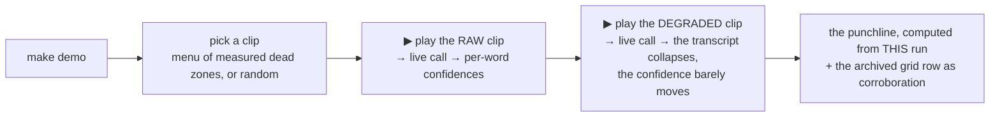

# Deadzone: Silent Failures in Speech Recognition

**A controlled-degradation rig that finds where an ASR model is *confidently wrong*.**
Real speech → real rooms → real noise → real codecs, one knob turned at a time, everything else held constant.

`176 acoustic conditions` × `60 clip-runs` — 40 clips on nova-3, 10 each on scribe_v2 and whisper-base — = **10,560 scored transcriptions**

> ### Motivation, Ideation
> A chat with Pranav (Deepgram, Applied AI Verticals) led me to think about STT model confidence, and how it is currently measured today. What stuck with me:
> - non-production voice-AI work, WER high → the loop is often *move sliders, re-measure, keep what went down* — without a mechanism
> - the open questions it left me with — how do **human and model perception** differ on the same audio? in a drive-thru, what actually drives WER: the physical setup, the speaker's distance from the mic, the type of mic feeding the agent?
>
> That conversation — plus [Ko et al., 2017](https://doi.org/10.1109/ICASSP.2017.7953152) (simulated rooms are a legitimate instrument, and the sim–real gap is itself measurable) and [Li et al., 2021](https://arxiv.org/abs/2010.11428) (end-to-end ASR confidence is
systematically overconfident) — made me want to **build an instrument for it**.

---

## 1 · The core idea

- aggregate WER = **one number** → hides *which* conditions break the model, *what kind* of error, and **whether the model knows**
- confidence is the deployment lever → for a voice agent it gates **act on the transcript** vs. **ask the caller to repeat**
- so the question flips: not *how much does it break* → **does it know it's breaking?**
- **dead zone** = a condition where the model is **wrong AND still confident regarding its error**

| | model reports **LOW** confidence | model reports **HIGH** confidence |
|---|---|---|
| transcript **correct** | conservative — costs a re-prompt | ✅ the good case |
| transcript **wrong** | recoverable — ask to repeat | ⛔ **DEAD ZONE** — commits, error propagates |

**NOTE: This methodology is NOT novel.** The genre is well-researched and the method is credited below.

The delta is the lens: confidence–accuracy gap per condition instead of WER per condition, and typed failure fingerprints instead of a scalar.

| contribution | reference |
|---|---|
| RIR augmentation stand-in for far-field audio | [Ko et al., 2017](https://doi.org/10.1109/ICASSP.2017.7953152) · ICASSP |
| the room simulator itself (image-source model) | [Scheibler et al., 2018](https://arxiv.org/abs/1710.04196) · ICASSP |
| prior art for grid-style ASR corruption benchmarks  | [Shah et al., 2025](https://arxiv.org/abs/2403.07937) · ICLR |
| end-to-end decoder softmax is systematically overconfident | [Li et al., 2021](https://arxiv.org/abs/2010.11428) · ICASSP |
| deletions carry no confidence  | [Qiu et al., 2021](https://arxiv.org/abs/2104.12870) · Interspeech |
| temperature scaling | [Guo et al., 2017](https://arxiv.org/abs/1706.04599) · ICML |
| Whisper's confidence is decoder-conditioned, not acoustic | [Radford et al., 2023](https://arxiv.org/abs/2212.04356) · ICML |

---

## 2 · The pipeline



- **Applied in physical order** — mouth → room → air → mic → wire. Reorder the stages and you're measuring a chain that can't exist in the real world.
- **Every ingredient is a real recording** — measured impulse responses, real DEMAND noise, real ffmpeg codec passes. We only control which ones combine, and how much.
- **Why not just use field recordings?** There, room + mic + noise + codec all move at once — so when WER moves you can't say what moved it. Here we turn one knob, freeze the rest → the change is attributable.

### The three correctness-critical "trap" functions

Each produces **clean-looking uninterpretable audio** which if subtly wrong — plausible audio, plausible numbers, no exception.

| function | the silent bug it prevents |
|---|---|
| `mix_at_snr` (signal-to-noise ratio) | SNR computed on **active speech only**. Whole-file power is deflated by silence → original "10 dB" isn't 10 dB, and the error **varies per clip** → a confound, not an offset. |
| `apply_rir` (room impulse response) | trim the room's **direct-path delay** (else every reverb cell inherits a pure timing artifact that reads as a reverb effect) **and** renormalize over the *input's* active region (the reverb tail inflates whole-file RMS (root-mean-square) → downstream SNR de-calibrated **by an amount that grows with RT60**, i.e. the bug looks exactly like a reverb finding) |
| `classify_errors` | WER **plus typed edits**, reference and hypothesis normalized **identically**. A constant orthography mismatch lands in every cell equally — mathematically indistinguishable from a dead zone. |

---

## 3 · The knobs

| knob | levels | stands in for |
|---|---|---|
| `rt60` | 0.2 · 0.45 · 0.7 · 1.0 s | room reverberation — **4 real measured rooms** |
| `snr_db` | 0 · 5 · 10 · 20 dB | background loudness vs. speech |
| `noise_type` | babble · engine · road | competing talkers / vehicle cabin / street |
| `codec` | none · g726 · opus-lowrate | narrowband telephony / low-rate VoIP |
| `mic_rolloff` | 0.0 · 0.5 · 1.0 | cheap microphone losing high frequencies |

<table>
<tr>
<td align="center"><b>40</b><br/>utterances<br/><sub>names · phone numbers · spelled codes · addresses</sub></td>
<td align="center"><b>176</b><br/>conditions<br/><sub>4×4×3×3 = 144 babble · + 32 engine/road corners</sub></td><td align="center"><b>3</b><br/>recognizers<br/><sub>nova-3 · scribe_v2 · whisper-base</sub></td>
</tr>
<tr>
<td align="center"><b>10,560</b><br/>scored rows<br/><sub>3 failures = 0.03%</sub></td>
<td align="center"><b>14,606</b><br/>API calls<br/><sub>≈ 998 min of audio</sub></td>
<td align="center"><b>$3.70</b><br/>total spend<br/><sub>frozen in results/MANIFEST.json</sub></td>
</tr>
</table>

Corpus floor: clean-condition WER **1.65%** (6 errors / 363 reference words), every error adjudicated by ear.

### ⚠️ Stated limitations

- **Everything ran BATCH, not streaming.** Deepgram via `listen.v1.media.transcribe_file` (never `listen.live`); Scribe via batch REST; Whisper locally with full-file lookahead. What is mapped is **acoustic robustness, not streaming behaviour** — a streaming decoder commits under a latency budget with truncated right context, a different failure surface. All three arms are batch, so the comparison is at least not mode-confounded. Batch also has full lookahead, the *easy* case → these numbers are optimistic vs. a streaming deployment, so the dead zones are a **lower bound**, not a ceiling.
- **One speaker, one accent, one sitting** → nothing here generalizes across talkers.
- **The reverb axis is 4 rooms** — Restaurant, Bar, Campground Dining Hall, Shower. None is a car cabin, an office, or a phone at 5 cm.
- **Degradation is synthetic** → the cost of that is measured, not asserted.
- **Lombard effect bracketed out** — in noise people change how they *produce* speech; no room simulator captures a behaviour.
- **Deletions carry no confidence at all.** Deletions are **69.3%** of nova-3's errors (40 clips), and a deleted word emits no token and therefore no confidence score → the headline signal is structurally blind to its own dominant failure mode.

---

## 4 · ▶ Demo 1 — the disagreement

> # ▶ RUN THIS
> ```bash
> make demo-listen
> ```
> `~3 min · offline · no API key · headphones on`
> You rank **two** pairs of clips by ear. Then you see what the model scored them.

**What it shows**



**The two conditions behind that corpus check**

| condition | one degradation only | nova-3 WER, 40 clips |
|---|---|---|
| **A** drenched but quiet | Shower RIR, DRR −10.0 dB, SNR 20 dB | **0.1123** |
| **B** dry but buried | Restaurant RIR, DRR +16.9 dB, SNR 0 dB | **0.1301** |

A vs B → **−0.018** paired difference, 95% CI **[−0.065, +0.031]** (spans zero) · **18 of 40** clips score exactly equal

**→ The measurement is the model side: on 18 of 40 clips these two conditions score *identically*, and the paired difference spans zero.** A human ranking and this model's ranking are not the same axis, and I could not check which was right by ear — so I built something that could, modeling WER and confidence, but NOT by ear.

---

## 5 · The finding: the confidence–accuracy gap

<p align="center">
  
</p>

**nova-3, 40 clips · 169 of 176 conditions that returned words** (the other 7 are mute — no words, so no confidence to score): **ρ = −0.980**, overconfident in **91%**.

- confidence anchor, so a number is interpretable: clean-condition mean **0.962** → best condition **0.981** → worst condition that still speaks **0.422**

<p align="center">
  
</p>

*Operating-point and aggregation choices (precision/recall, why mean over min/p10, and the mismatched all-clips pairing ρ = −0.952 — the same 169 conditions scored against WER over **every** clip instead of only the ones that transcribed) are validated — covered live.*

### The count, and why it is not the headline

**2 of 176 (1.14%)** conditions clear the published operating point (`WER ≥ 0.30` and confidence in this model's top 40%). Worst: `rt60 0.45 s · SNR 0 dB · engine · g726 · rolloff 0` → **0.829** confidence at WER **0.306**, **0 of 40** clips silent.


### Three categories, not one

Not every low-confidence-looking condition is the same failure. On nova-3, 40 clips:

| category | n | what it means | the fix it implies |
|---|---|---|---|
| **dead zone** | **2** | confidently wrong on the clips it spoke on | confidence threshold / calibration |
| **silence-driven** | **4** | apparent gap = clips vanishing, not confident error | **emission-rate alarm** |
| **mute zone** | **7** | empty transcript on **every** clip | **no confidence to monitor — a calibration alarm is blind here** |

> ### 🔎 A silent bug I caught in my own headline
> v1 reported **6** dead zones — wrong. Confidence was averaged over clips that spoke, WER over *all* clips including empty ones → **two populations, subtracted** (+0.109 mean inflation). Right row count, no NaN, no failing test. **What caught it: listening — the "dead zone" clips sounded fine.** The fix is a *guard*, not a patch: `find_dead_zones` is now a view over `classify_conditions`, so **you can't get dead zones without also being handed the mute zones.**

---

## 6 · ▶ Demo 2 — the hero

> # ▶ RUN THIS
> ```bash
> make demo
> ```
> `~2 min · you pick the clip · two REAL Deepgram calls` — every number on screen comes from the two responses that just arrived



---

## 7 · Three models

> ### ⚠️ POPULATION — an analysis note
> nova-3 ran **40 clips**. whisper-base and elevenlabs-scribe ran a **10-clip subset**.
> **Every number in this section is the 10 clips all three arms ran — 1,757 rows per arm.**
> Same model, two correct answers: nova-3's dead-zone rate is **1.14% (2/176)** on 40 clips and **0.57% (1/176)** on 10. Quoting either without its clip count is the error.
> **Two columns below are NOT that population, and say so:** ECE and AUROC are each computed **within-arm over that arm's full run** — nova-3 40 clips (42,732 words · 7,040 rows), Scribe and Whisper 10 clips (14,668 words · 1,760 and 1,757 rows). Neither statistic subtracts one arm from another, so a full-run figure is the right one to report; it is simply not the matched intersection, and mixing the two silently is the §5 bug one section later.

<p align="center">
  
</p>

**Dead-zone rate and ρ(confidence, WER) are in the chart above.** What it doesn't show — same 10-clip intersection, 1,757 rows per arm:

| arm | utterance AUROC ‡ | ECE raw → +temp → +features ‡ | silent rows | mute conditions |
|---|---|---|---|---|
| **nova-3** | **0.944** | **0.0507 → 0.0346 → 0.0077** | 24.5% | 12 |
| **elevenlabs-scribe** | 0.737 | 0.1646 → 0.0755 → 0.0340 ^ | **4.4%** | 2 |
| **whisper-base** | 0.888 | **BLOCKED** § | 19.1% | 5 |

^ **upper bound** — correctness labels come from the same alignment as WER, so orthography disagreements label correct words incorrect.
§ **BLOCKED** — whisper's hypothesis-word count and confidence-list length disagree after alignment; binding them would score the *wrong* words, so ECE is not included. AUROC survives because it needs only a ranking of confidences against a bad/good label, not word-level correctness binding.
AUROC = same aggregate (arithmetic mean) for every arm, `bad = row WER ≥ 0.3`, computed **strictly inside** each arm.
‡ **full run per arm** (nova-3 40 clips, others 10) — see the population box above.

> ⚠️ **This is NOT a "commercial beats open" result — read the columns against each other.**
> nova-3 leads on **every confidence** statistic (not on silent rows or mute conditions — see the table). **Scribe and Whisper swap depending on which one you read** — Scribe ahead on ρ (−0.820 vs −0.590), **Whisper ahead on utterance-level AUROC (0.888 vs 0.737)**.
> *Scribe has no dead-zone rate in this comparison on purpose:* a dead zone is an **absolute** WER threshold, and Scribe's orthography is a per-call draw — its 7 strict dead zones fall to **0** under the normalizer. They were spelling, not confident error. A statistic that is "within-model" can still be a *level* statistic; that one is.
> n = 3 arms with only **one** open model, and it is also the only **small** one (74M) → commercial-vs-open, vendor, and size are all confounded.

### nova-3 — knows it's failing, then goes quiet
- best-calibrated arm, and the only one clean enough to fit: **ECE 0.0507 → 0.0077** (feature-conditioned, held-out conditions)
- failure mode = **deletion / silence**: 24.5% of rows empty, 12 mute conditions
- **the finding:** a deleted word emits no token → no confidence → its dominant failure is invisible to the exact signal this project proposes

### elevenlabs-scribe — talks through anything
- **5.5× less likely to go silent** than nova-3 (4.4% vs 24.5%)
- calibrates worse, needs a harder correction: **T = 4.11** vs nova-3's **1.39**
- **no resolution at the top**: 47.4% of words within 0.001 of 1.0 (nova-3: 15.3%) — tied words can't be ranked
- **excluded from cross-model WER** (§9) — orthography is non-deterministic

### whisper-base — worse, and worse at *knowing* it
- ρ **−0.590** vs nova-3's **−0.970** on the same rows
- calibration **uncomputable**: 69 rows have confidence-list length ≠ word count after alignment → binding would tie confidences to the wrong words
- **opposite failure mode**: insertions **9.4×** nova-3's (0.197 vs 0.021) — **nova-3 goes quiet, Whisper invents**
- **WER exceeds 1.0** — only possible because insertions are unbounded

<p align="center">
  
</p>

> **⚠️ A counting bug I caught in my own figure.** This was reported across the repo as **3 → 49**. Wrong: `hallucination_report` normalizes spoken numbers to digits, then tokenizes `[a-z']+` (letters only) — building 8 digit tokens and discarding them, which collapses the 11-word reference to 3. Correct: **11 → 47, WER 4.18**.

**Why WER hides this:** it caps damage at one error per word — but a 47-word invention handed to a downstream agent is unbounded harm. Across the arm, **9.9%** of rows exceed 2× the reference length (nova-3: 0.1%).

<!-- MODEL-ARCH-SPECULATION: sourced from report/model_architecture_notes.md -->
> ### 💭 POTENTIAL EXPLANATION — hypothesis, **not measured here**
> Everything above is behaviour I measured; below is a tagged guess at *why*. Sources + falsification tests: [`report/model_architecture_notes.md`](report/model_architecture_notes.md).
>
> - **Whisper's confidence scores what it *generated*, not what it heard** — it's a decoder-context score, so inside a repetition loop the context alone keeps it high while the audio contributes almost nothing. OpenAI ships a gzip-ratio check precisely because log-prob doesn't catch these loops. *(documented; mechanism in the notes)*
> - **Deepgram's field is only "overall transcript reliability"** — no derivation, no calibration claim, no architecture. **The best-performing arm is the one we can say the least about.**
> - **The confound against our own headline:** nova-3 fails by *deleting*, and deletions carry no confidence — so its failures are structurally excluded from the stat that ranks it best. Whisper fails by *inserting*, so its failures must carry a score. Part of the ranking may be *which failure mode the metric can see*.
> - **Size, not just vendor:** `whisper-base` is **74M**; both commercial arms are undisclosed and larger. "Commercial vs open" isn't separated from "large vs small."

---

## 8 · Failure fingerprints — each error type implies a *different* fix

<p align="center">
  
</p>

**The mechanism:** a **deletion** means the word never reached the decoder (no token emitted) → only a **front-end** fix recovers it. A **substitution** means a wrong word *was* emitted from degraded evidence → a **decoding-side prior** (boosting, entity-aware decoding) can recover it. That's why the chart's split matters: 7 of 9 families are deletion-dominant (front-end work), and only `g726` and road noise are substitution-dominant (where boosting actually helps).

**Entities die faster than words** (nova-3, 40 clips) — entity error rate **0.633** vs. WER **0.511**. But not uniformly:

| word class | destroyed |
|---|---|
| **proper nouns** | **0.646** |
| spelled letters | 0.613 |
| content words | 0.530 |
| function words | 0.462 |
| **digit words** | **0.361** ← *least* destroyed |

**→ "entities degrade fastest" is carried by names and spelled codes, not numbers** — the naive read gets it backwards.

**Insertions under babble are a different mechanism:** **92%** are tokens absent from the reference → the model transcribing the *background talkers*, not confusing the target. Fix is speaker gating, **not** denoising.

---

## 9 · Confidence is compared *within* a model — enforced, not conventional

Three arms return confidence on **three unrelated scales** (whole-grid median differs ~3× across them), so a shared absolute threshold is meaningless — every cross-arm claim goes through `within_model_conf_percentile`.

**`elevenlabs-scribe` is excluded from cross-model WER** (`model_compare` raises — no flag includes it), and the reason is principled, not convenient: Whisper's orthography offset is a **constant** (+0.090 — characterize once, subtract), but Scribe's is a **per-call draw** — 4 identical calls on byte-identical audio gave different transcripts on **5 of 6** probe clips, up to **0.727 WER on identical input**. Variance, not bias: a constant can be subtracted, a coin flip cannot. The inconvenient part: Scribe scores *better* than nova-3 on raw WER — the reason those numbers are incomparable was found on the arm that would have succeeded.

**Normalizer audit** (`shift = strict − normalized`, 1,757 shared rows):

| arm | shift | reading |
|---|---|---|
| nova-3 | **−0.014** | already word-form → ≈ 0 as predicted (the control) |
| whisper-base | **+0.090** | a constant the normalizer recovers — spelling, not accuracy |
| elevenlabs-scribe | **+0.064** | *mean* of a per-call draw — the mean isn't the problem, the draw is |


---

## 10 · Run it

```bash
python3 -m venv .venv && ./.venv/bin/python -m pip install -r requirements.txt
make test          # every offline suite — no key, no network, no audio
make demo-check    # preflight: every artifact on disk, and can it run live?
make demo          # the hero: one clip, played and transcribed live, twice
make demo-replay   # the same beat from cache — rehearse it with wifi OFF
```

| path | what |
|---|---|
| `deadzone/` | importable library — nothing here spends money or writes an artifact |
| `deadzone/audio_pipeline.py` | the three trap functions + every ASR adapter behind one contract |
| `deadzone/conditions.py` | the degradation composer + disk-backed asset library |
| `deadzone/analysis/` | the finding layers, all reading the same master table |
| `scripts/` | entry points that **spend money or write artifacts** — the boundary is deliberate |
| `dashboard/` | self-contained 8-panel HTML, opens from `file://` |
| `tests/` | fully offline; every stage validated on synthetic signals first |

Further reading: **[`report/writeup.md`](report/writeup.md)** (results + all limitations) · **[`report/UNDERSTANDING.md`](report/UNDERSTANDING.md)** (where this work is weak, in plain English) · **[`SPEC.md`](SPEC.md)** (full brief + build log) · `results/MANIFEST.json` (the experiment freeze — git SHA, exact model literals, asset hashes, realized cost)

---

<details>
<summary><b>Appendix — things I tried that did not work</b> (click to expand)</summary>

<br/>

### (a) The active-learning surrogate lost to random sampling

**The idea:** fit a GP to what has been measured, use straddle (boundary-seeking) acquisition to pick the next condition → map the failure boundary in fewer expensive evaluations than a grid.

**The result: a null.** At a 45-evaluation budget the `boundary_rmse` target was reached by **2 of 8 active seeds** against random's **4 of 8**. Median evals-to-target is `inf` for both arms → no ratio is reportable and none is claimed.

- **the acquisition function demonstrably worked** — it placed **58.3%** of its chosen evaluations near the decision contour against random's **21.1%**. It did its job; the job did not pay.
- **not a broken implementation** — the synthetic control in `tests/test_active_learning.py` still passes with "active sampling reaches target fidelity in far fewer oracle calls than random". A method meeting a surface it has no purchase on.
- **why:** the reverb axis is **4 discrete measured rooms**, not the smooth surface a GP assumes. A GP given `rt60` as a continuous coordinate assumes a smoothness the instrument does not have.
- **the obvious fix also failed.** Re-running in DRR coordinates (which order the four rooms perfectly, ρ = −1.000, where RT60 does not, ρ = +0.800) changed nothing — **0 of 4** splits won. The **negative control is the result**: across all 24 permutations of the same four DRR values, the physically correct assignment ranks **18th of 24** (permutation p = **0.75**). A random relabelling does as well as the right one.
- all 8 seeds ran against a **surrogate oracle** — **no seed was confirmed end-to-end against the live API**

**Honest reading:** the null belongs to the *surface*, not to the acquisition function. The fix is **more rooms**, not a better coordinate — and I know that because I tested the better-coordinate hypothesis and it failed a permutation control.

### (b) The listening pre-registration failed — and its rubric could not fail

A sealed prediction, written before anyone listened: a human would rank the babble-dominated clip clearly harder than the reverb-dominated one in two named pairs, while the model scores them exactly equal.

- **predicted direction held in 1 of 3 pairs.** The listener found the *reverb* arm harder in two of three.
- scored strictly against the prediction's own wording ("a confident, immediate, non-marginal call in both pairs") it **fails in both named pairs**
- **the worse problem:** the sealed "what each outcome means" section listed two outcomes — *unequal → holds*, *equal → fails*. It never considered **"unequal, but backwards."** Under the rubric as written this backwards result scores as a **PASS**. A pre-registration whose outcomes do not span what can be observed is decoration.
- **what survives:** the listener had a stated preference in **3 of 3** pairs while the model scored each pair **exactly equal**. The disagreement stands; the *mechanism* originally offered for it does not.

*(The project ran two pre-registrations. The one with a **numeric** decision rule — reverb × noise interaction, committed `d8ddd4f` before any audio existed — **confirmed**. The one with a prose rule failed and was unfalsifiable.)*

### (c) Simulated rooms: right order, wrong level, zero dead zones

Re-running the identical condition list with **synthetic** pyroomacoustics RIRs instead of measured ones, both arms restricted to the 10 clips they share:

| aspect | result | practitioner reading |
|---|---|---|
| **LEVEL** | sim **underestimates WER by 12.1 points** (95% CI [−15.0, −9.6]) | never quote an absolute number from a sim-only testbed |
| **ORDER** | Spearman **ρ = 0.873** | ranking conditions is fine |
| **TRANSFER** | dead-zone **Jaccard 0.00** — 1 real, 0 found | a sim-only rig recovers **none** of the real dead zones |

**And the clip matching is load-bearing:** comparing the 40-clip real arm against the 10-clip sim arm reads a **19.9**-point gap — 7.8 points of which is pure clip-difficulty confound, a corpus difference masquerading as a simulation gap. That figure is **retracted** and must never appear as a result. Same shape as the estimand bug in §5, one layer up.

**Dead-zone maps transfer poorly and unpredictably.** nova-3 shares **zero** dead zones with whisper-base (Jaccard 0.000) and zero with Scribe — but Scribe and whisper-base share **7** (Jaccard **0.101**). So: sometimes no transfer at all, sometimes partial. **You cannot borrow someone else's dead-zone map.**

</details>
