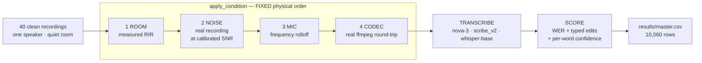
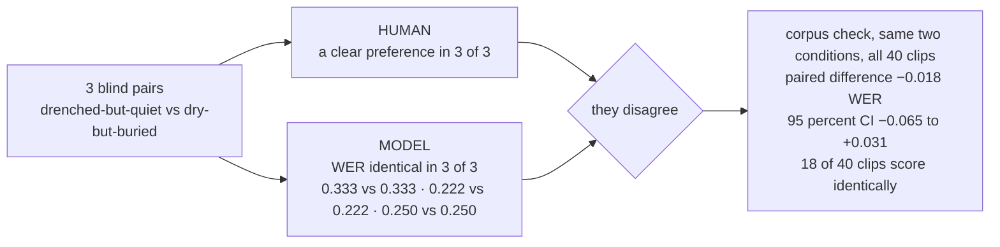
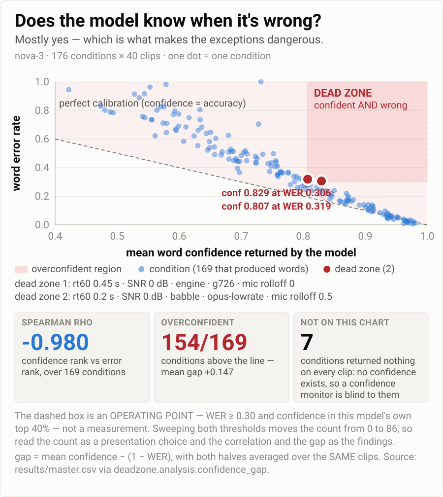
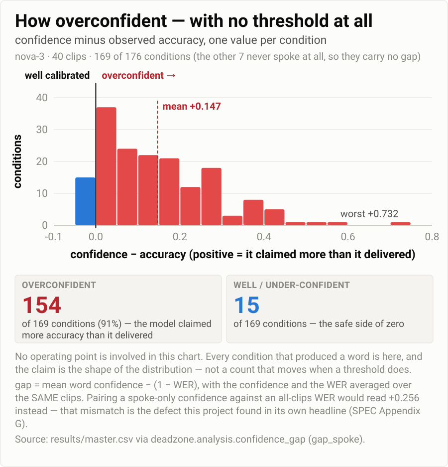
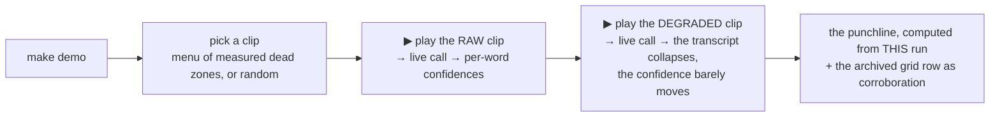
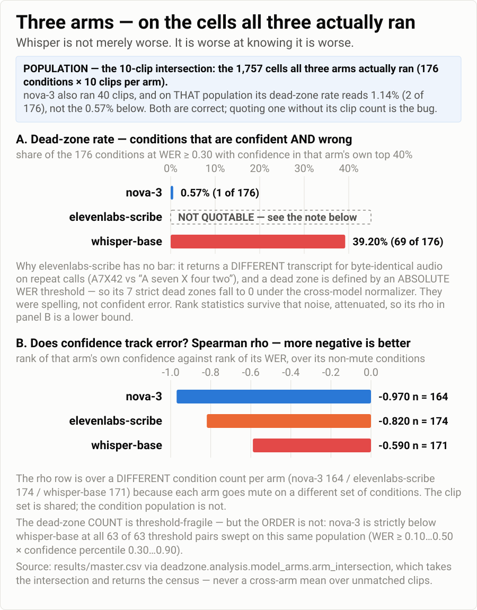
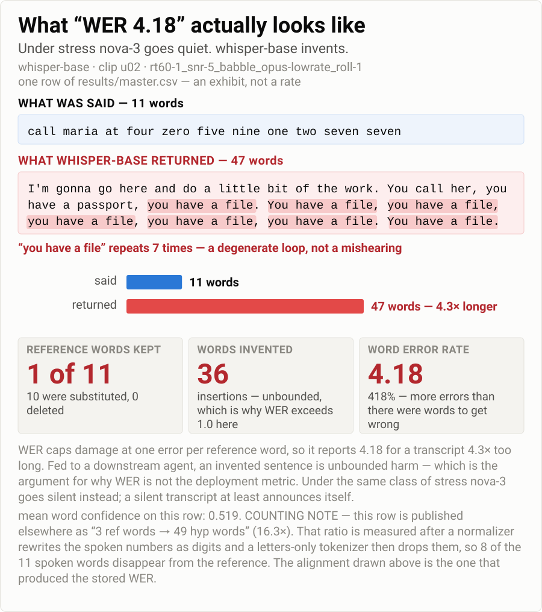
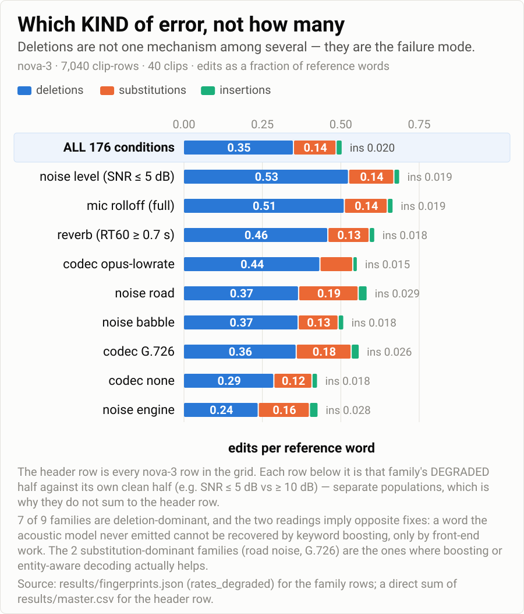
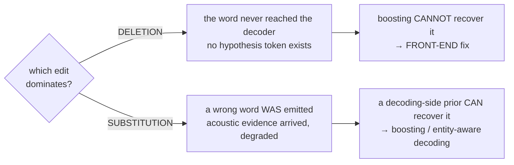

# Deadzone: Silent Failures in Speech Recognition

**A controlled-degradation rig that finds where an ASR model is *confidently wrong*.**
Real speech → real rooms → real noise → real codecs, one knob at a time, everything else held still.

`40 utterances` × `176 acoustic conditions` × `3 recognizers` = **10,560 scored transcriptions**

> ### Why I built it
> A coffee chat with someone at Deepgram who works on deployed voice agents. What stuck with me:
> - non-production voice-AI work, WER high → the loop is often *move sliders, re-measure, keep what went down* — without a mechanism
> - the open questions it left me with — how do **human and model perception** differ on the same audio? in a drive-thru, what actually drives WER: the physical setup, the speaker's distance from the mic, the **type of mic** feeding the agent?
>
> That conversation, plus a couple of well-known papers it sent me to, made me want to build an instrument for it.
> *(This is what motivated **me**. It is not a claim about what Deepgram has or hasn't studied.)*

---

## 1 · The core idea

- aggregate WER = **one number** → hides *which* conditions break the model, *what kind* of error, and **whether the model knows**
- confidence is the deployment lever → it decides **commit** vs. **ask the caller to repeat**
- so the question flips: not *how much does it break* → **does it know it's breaking?**
- **dead zone** := a condition where the model is **wrong AND still confident**

| | model reports **LOW** confidence | model reports **HIGH** confidence |
|---|---|---|
| transcript **correct** | conservative — costs a re-prompt | ✅ the good case |
| transcript **wrong** | recoverable — ask to repeat | ⛔ **DEAD ZONE** — commits, error propagates |

**Positioning — no novelty claimed:**
- the genre is well-trodden → WildASR / "Back to Basics" · Speech Robustness Bench · "When Denoising Hinders" · RIR augmentation (Ko et al. 2017) · REVERB / CHiME · pyroomacoustics (Scheibler 2018)
- **the method is theirs.** The delta is the **lens** — confidence–accuracy gap *per condition* instead of WER per condition, and typed failure fingerprints instead of a scalar

---

## 2 · The pipeline



- order = the **physical signal chain** — mouth → room → air → mic → wire; permuting it is a different experiment
- every **ingredient is real** (measured impulse responses, recorded DEMAND noise, real ffmpeg round-trips) — only the **assembly** is controlled
- why simulate at all → **counterfactual isolation**: in a field recording mic, placement, noise and codec all move at once, so no factor is attributable

### The three correctness-critical "trap" functions

Each produces **clean-looking garbage** if subtly wrong — plausible audio, plausible numbers, no exception. Each ships with an offline test.

| function | the silent bug it prevents |
|---|---|
| `mix_at_snr` | SNR computed on **active speech only**. Whole-file power is deflated by silence → your "10 dB" isn't 10 dB, and the error **varies per clip** → a confound, not an offset. |
| `apply_rir` | trim the room's **direct-path delay** (else every reverb cell inherits a pure timing artifact that reads as a reverb effect) **and** renormalize over the *input's* active region (the reverb tail inflates whole-file RMS → downstream SNR de-calibrated **by an amount that grows with RT60**, i.e. the bug looks exactly like a reverb finding) |
| `classify_errors` | WER **plus typed edits**, reference and hypothesis normalized **identically**. A constant orthography mismatch lands in every cell equally — mathematically indistinguishable from a dead zone. |

---

## 3 · The knobs

| knob | levels | stands in for |
|---|---|---|
| `rt60` | 0.2 · 0.45 · 0.7 · 1.0 s | room reverberation — **4 real measured rooms** |
| `snr_db` | 0 · 5 · 10 · 20 dB | background loudness vs. speech |
| `noise_type` | babble · engine · road | competing talkers / vehicle cabin / street |
| `codec` | none · g726 · opus-lowrate | narrowband telephony / low-rate VoIP |
| `mic_rolloff` | 0.0 · 0.5 · 1.0 | cheap microphone losing high frequencies |

<table>
<tr>
<td align="center"><b>40</b><br/>utterances<br/><sub>names · phone numbers · spelled codes · addresses</sub></td>
<td align="center"><b>176</b><br/>conditions<br/><sub>core is a complete 4×4×3×3 factorial</sub></td>
<td align="center"><b>3</b><br/>recognizers<br/><sub>nova-3 · scribe_v2 · whisper-base</sub></td>
</tr>
<tr>
<td align="center"><b>10,560</b><br/>scored rows<br/><sub>3 failures = 0.03%</sub></td>
<td align="center"><b>14,606</b><br/>API calls<br/><sub>≈ 998 min of audio</sub></td>
<td align="center"><b>$3.70</b><br/>total spend<br/><sub>frozen in results/MANIFEST.json</sub></td>
</tr>
</table>

Corpus floor: clean-condition WER **1.65%** (6 errors / 363 reference words), every error adjudicated by ear.

### ⚠️ Stated limits — read these before the numbers

- **Everything ran BATCH, not streaming.** Deepgram via `listen.v1.media.transcribe_file` (never `listen.live`); Scribe via batch REST; Whisper locally with full-file lookahead. What is mapped is **acoustic robustness, not streaming behaviour** — a streaming decoder commits under a latency budget with truncated right context, a different failure surface. All three arms are batch, so the comparison is at least not mode-confounded.
- **One speaker, one accent, one sitting** → nothing here generalizes across talkers.
- **The reverb axis is 4 rooms** — Restaurant, Bar, Campground Dining Hall, **Shower**. None is a car cabin, an office, or a phone at 5 cm.
- **Degradation is synthetic** → the cost of that is measured, not asserted (§8, sim2real).
- **Lombard effect bracketed out** — in noise people change how they *produce* speech; no room simulator captures a behaviour.
- **Deletions carry no confidence at all** → the headline signal is structurally blind to **69.3% of all errors**.

---

## 4 · ▶ Demo 1 — the disagreement

> # ▶ RUN THIS
> ```bash
> make demo-listen
> ```
> `~3 min · offline · no API key · headphones on`
> You rank three pairs of clips by ear. Then you see what the model scored them.

**What it shows**



| condition | one degradation only | nova-3 WER, 40 clips |
|---|---|---|
| **A** drenched but quiet | Shower RIR, DRR −10.0 dB, SNR 20 dB | **0.1123** |
| **B** dry but buried | Restaurant RIR, DRR +16.9 dB, SNR 0 dB | **0.1301** |

paired difference **−0.018**, 95% CI **[−0.065, +0.031]** — spans zero · **18 of 40** clips exactly equal

**→ "It sounds fine to me" is not evidence the ASR works.**

> ⚠️ **The human half is n = 1, unblinded to the hypothesis, not counterbalanced.** It is an intuition pump, never data. The **measured** half is the model-side paired interval above. A pre-registered prediction about *which* arm the listener would find harder **failed** — see the appendix.

---

## 5 · The finding: the confidence–accuracy gap

<p align="center">
  
</p>

**Lead with the threshold-free form.** nova-3, 40 clips, the **169 of 176** conditions that returned any words:

<table>
<tr>
<td align="center"><b>ρ = −0.980</b><br/><sub>confidence vs. error, paired<br/>(−0.952 against every clip)</sub></td>
<td align="center"><b>91%</b><br/><sub>of conditions overconfident<br/>154 of 169</sub></td>
<td align="center"><b>+0.147</b><br/><sub>mean gap<br/>confidence − delivered accuracy</sub></td>
</tr>
</table>

<p align="center">
  
</p>

- the model is **mostly self-aware** — that is the dangerous part: anything tuned on its *average* self-knowledge trusts it precisely in the residual
- confidence anchor, so a number is interpretable: clean-condition mean **0.962** → best condition **0.981** → worst condition that still speaks **0.422**
- operating point this buys: flag the lowest-confidence **10%** of utterances → precision **0.994**, recall **0.249** (`bad := WER ≥ 0.3`)
- aggregation was **measured, not assumed**: arithmetic mean AUROC **0.944** — nothing beat it, and `min` / `p10` are significantly **worse**

### The count, and why it is not the headline

**2 of 176 (1.14%)** conditions qualify at the published operating point (`WER ≥ 0.30` and confidence in the top 40% of this model's own distribution).
Worst: `rt60 0.45 s · SNR 0 dB · engine · g726 · rolloff 0` → confidence **0.829** at WER **0.306**, with **0 of 40** clips silent.

> ⚠️ **The count is an operating point, not a measurement.** Sweeping both thresholds over a defensible box (`results/dead_zone_sensitivity.txt`): **13** at conf-pct 0.50, **2** at 0.60, **0** at 0.70 — and **0 to 86** across the whole box. Verdict in the artifact: **FRAGILE**. The continuous numbers above need no threshold at all.

### Three categories, not one

| category | n | what it means | the fix it implies |
|---|---|---|---|
| **dead zone** | **2** | confidently wrong on the clips it spoke on | confidence threshold / calibration |
| **silence-driven** | **4** | apparent gap = clips vanishing, not confident error | **emission-rate alarm** |
| **mute zone** | **7** | empty transcript on **every** clip | **a confidence monitor is blind to these — there is no confidence to be low** |

> ### 🔎 The headline was published wrong once, and a test did not catch it
> - v1 reported **6** dead zones at mean gap 0.256
> - defect: per-condition **confidence** averaged over clips that produced words, **WER** averaged over *all* clips including empty ones → **two averages over different populations, subtracted**
> - right row count, no NaN, no exception, no failing test — inflation mean **+0.109**, max **+0.524**
> - what found it: **listening** to the exemplar clips and noticing they sounded intelligible
> - the fix ships as a **guard**, not a patch: both pairings are published, the mismatched one exists only under an explicit name (`gap_all_clips`), the estimand is named at the call site (`wer_key=`), and `find_dead_zones` is now a thin view over `classify_conditions` so **you cannot get dead zones without also being handed the mute zones**

---

## 6 · ▶ Demo 2 — the hero

> # ▶ RUN THIS
> ```bash
> make demo
> ```
> `~2 min · you pick the clip · two REAL Deepgram calls` — every number on screen comes from the two responses that just arrived



**Safe without wifi.** No key, no network, a vendor error or a timeout each print one line, fall back to the archived measurements for the same clip and condition, and **exit 0**. `make demo-replay` runs the whole beat from cache — that is rehearsal mode and the instant fallback.

`make demo-check` = preflight · `make demo-all` = the full scripted path (`test-core` → hero → `demo-al` → dashboard) · `make demo-break` / `make demo-live` = the two halves on their own, kept as fallbacks · 3-minute spoken path in [`dashboard/DEMO.md`](dashboard/DEMO.md)

---

## 7 · Three models

> ### ⚠️ POPULATION — the trap this project has fallen into three times
> nova-3 ran **40 clips**. whisper-base and elevenlabs-scribe ran a **10-clip subset**.
> **Every number in this section is the 10 clips all three arms ran — 1,757 rows per arm.**
> Same model, two correct answers: nova-3's dead-zone rate is **1.14% (2/176)** on 40 clips and **0.57% (1/176)** on 10. Quoting one without its clip count is the bug.

<p align="center">
  
</p>

| arm | dead-zone rate | ρ(confidence, WER) | utterance AUROC | ECE raw → +temp → +features | silent rows | mute conditions |
|---|---|---|---|---|---|---|
| **nova-3** | **0.57%** (1/176) | **−0.970** (n = 164) | **0.944** | **0.0507 → 0.0346 → 0.0077** | 24.5% | 12 |
| **elevenlabs-scribe** | 3.98% (7/176) ‡ | −0.820 (n = 174) | 0.737 | 0.1646 → 0.0755 → 0.0340 ^ | **4.4%** | 2 |
| **whisper-base** | **39.20%** (69/176) | **−0.590** (n = 171) | 0.888 | **BLOCKED** — alignment | 19.1% | 5 |

‡ **not quotable** — under the cross-model normalizer all 7 fall to **0**; they are orthography, not confident error.
^ **upper bound** — correctness labels come from the same alignment as WER, so orthography disagreements label correct words incorrect.
Each ρ is over **that arm's own** non-mute conditions (164 / 174 / 171) — shapes, not a ranking. AUROC = same aggregate (arithmetic mean) for every arm, `bad := row WER ≥ 0.3`, computed **strictly inside** each arm.

> ⚠️ **This is NOT a "commercial beats open" result — read the columns against each other.**
> nova-3 leads on **every** statistic. **Scribe and Whisper swap depending on which one you read** — Scribe ahead on ρ (−0.820 vs −0.590) and dead-zone rate (3.98% vs 39.20%), **Whisper ahead on utterance-level AUROC (0.888 vs 0.737)**.
> n = 3 arms with only **one** open model, and it is also the only **small** one (74M) → commercial-vs-open, vendor, and size are all confounded.

### nova-3 — knows it is failing, then goes quiet
- best confidence shape of the three, and the only arm whose calibration is clean enough to fit: **ECE 0.0507 → 0.0077** with a feature-conditioned calibrator on held-out **conditions**
- learned discount, stated operationally: **above `rt60 = 0.7`, discount reported confidence by ~0.07** (0.81 reported vs. 0.75 observed on 8,144 held-out words)
- failure mode = **deletion / silence** — 24.5% of rows come back empty, 12 conditions are mute
- **the sting:** a deleted word carries **no hypothesis token and therefore no confidence**, so its dominant failure is invisible to exactly the early-warning signal this project proposes

### elevenlabs-scribe — talks through anything
- **5.5× less likely to go silent** than nova-3 (4.4% vs 24.5%), 2 mute conditions vs 12
- calibrates worse and needs a much harder correction: temperature **T = 4.11** vs nova-3's **T = 1.39**
- **its confidence has no resolution at the top**: **47.4%** of its emitted words sit within 0.001 of 1.0 (nova-3: 15.3%) — tied words cannot be ordered by any threshold or percentile
- **excluded from every cross-model WER comparison** (§9) — its orthography is non-deterministic

### whisper-base — worse, and worse at *knowing* it is worse
- dead-zone rate **39.20%** against nova-3's 0.57% on the same rows; ρ **−0.590** against **−0.970**
- calibration **cannot be computed**: 69 of 1,757 rows have a hypothesis-word count disagreeing with the confidence-list length after re-alignment → `word_records` **refuses to zip** (zipping would bind confidences to the wrong words)
- **opposite failure mode**: normalized insertions **0.197** vs nova-3's **0.021** = **9.4×** — under stress **nova-3 goes quiet, Whisper invents**
- WER **exceeds 1.0** — possible only because insertions are unbounded

<p align="center">
  
</p>

```
[u02 @ rt60-1_snr-5_babble_opus-lowrate_roll-1]      3 reference words  ->  49 hypothesis words
REF: call maria at
HYP: I'm gonna go here and do a little bit of the work. You call her, you have a
     passport, you have a file. You have a file, you have a file, you have a file,
     you have a file, you have a file. You have a file.
```

**WER understates this.** WER caps damage at one error per reference word; a 49-word invention handed to a downstream LLM agent is unbounded harm. Across the arm: **9.9%** of rows exceed 2× the reference length (p95 length ratio **2.75**) against nova-3's 0.1%.

<!-- MODEL-ARCH-SPECULATION: sourced from report/model_architecture_notes.md -->
> ### 💭 POTENTIAL EXPLANATION — hypothesis, **not measured here**
> Everything above is behaviour I measured. Everything below is a guess at *why*, tagged. Sources + falsification tests: [`report/model_architecture_notes.md`](report/model_architecture_notes.md).
>
> - **DOCUMENTED — Whisper's confidence scores what it *generated*, not what it heard.** Per `whisper/timing.py::find_alignment`, the per-word number is the mean over a word's subword tokens of the decoder's next-token softmax **conditioned on the tokens it already emitted** — a joint acoustic + own-context score. **SPECULATION:** inside a repetition loop the context alone makes the next token near-certain, so the score stays high while the audio contributes almost nothing.
> - **DOCUMENTED — OpenAI ships a workaround for exactly this.** `whisper/transcribe.py` defaults include a **gzip compression-ratio check (threshold 2.4)** alongside the log-prob threshold. A gzip test exists because the log-probability does **not** reliably catch repetition loops — a loop is both highly compressible *and* highly probable under its own context. The model card documents the hallucination and the repetition tendency in the vendor's own words.
> - **DOCUMENTED — Deepgram's field is defined only as "a floating point value between 0 and 1 that indicates overall transcript reliability."** No derivation, no claim of calibration, no architecture published. **The best-performing arm is the one I can say the least about.** *(A Deepgram patent describes an autoregressive encoder-decoder — but filed ≠ shipped, so it is not evidence about `nova-3`.)*
> - **SPECULATION — the confound that cuts against my own headline.** nova-3 fails by **deleting**; a deleted word carries no confidence, so most of its failures are **structurally excluded** from the statistic that ranks it best. Whisper fails by **inserting**, so nearly every failure must carry a score that can be wrong. Part of the ordering may be *which failure mode the metric can see*.
> - **CONFOUNDED — size, not only vendor.** `whisper-base` is **74M** parameters; both commercial arms are undisclosed and near-certainly larger. "Commercial vs open" is not separated from "large vs small."

---

## 8 · Failure fingerprints — each error type implies a *different* fix

<p align="center">
  
</p>

**Don't count errors — classify them.** nova-3, 63,888 reference words:

<table>
<tr>
<td align="center"><b>deletions 0.351</b><br/><sub>the failure mode</sub></td>
<td align="center">substitutions 0.136</td>
<td align="center">insertions 0.020</td>
</tr>
</table>

**The mechanism that makes this actionable:**



| degradation | dominant edit | Δ edit rate vs. its clean level | implied fix |
|---|---|---|---|
| falling SNR (≤ 5 dB) | **deletion** | **+0.344** | front end — gain, VAD thresholds, denoise |
| mic rolloff (1.0) | **deletion** | **+0.264** | front end — capture chain / EQ |
| reverb (≥ 0.7 s) | **deletion** | **+0.212** | dereverberation (WPE), closer or beamformed capture |
| `opus-lowrate` | **deletion** | +0.111 | front end / bitrate |
| **`g726`** | **substitution** | **+0.061** | **keyword boosting + entity-aware decoding** |
| **road noise** | **substitution** | **+0.059** | boosting + condition-matched augmentation |
| engine noise | *fewer* deletions | −0.127 | **NO FIX** — a relative improvement |
| `codec = none` | *fewer* deletions | −0.104 | **NO FIX** — a relative improvement |

**Entities die faster than words:** entity error rate **0.633** vs. WER **0.511**.

| word class | destroyed |
|---|---|
| **proper nouns** | **0.646** |
| spelled letters | 0.613 |
| content words | 0.530 |
| function words | 0.462 |
| **digit words** | **0.361** ← the *least* destroyed |

**→ "entities degrade fastest" is carried by names and spelled codes, not by numbers.** The naive read of that table gets it backwards.

**Insertions under babble are a different mechanism:** **92%** are tokens absent from the reference → the model transcribing the **background talkers**, not confusing the target. Fix is target-speaker extraction / speaker gating, **not** denoising.

---

## 9 · Confidence is compared *within* a model — enforced, not conventional

- three arms return confidence on **three unrelated internal scales** — clean-condition median word confidence differs by ~3× across them
- a shared absolute threshold across arms would be **meaningless** → every cross-arm confidence claim goes through `within_model_conf_percentile`
- **`elevenlabs-scribe` is excluded from cross-model WER, and `model_compare` raises** — there is no flag that includes it

| why the exclusion is principled, not convenient | |
|---|---|
| Whisper's orthography offset | a **constant** (+0.090) → characterize once, subtract — that is what `cross_model_norm.py` does |
| Scribe's orthography | a **per-call draw** — 4 identical calls on byte-identical audio → different transcripts on **5 of 6** probe clips, up to **0.727 strict WER** on identical input |
| the difference that matters | **variance, not bias** — a constant can be subtracted; a coin flip cannot |
| it is also the inconvenient outcome | Scribe scores **better** than the spine on raw WER, and the reason those numbers are incomparable was discovered on the arm that would have won |

**The audit that validates the normalizer** (`shift = strict − normalized`, over the 1,757 shared rows):

| arm | shift | reading |
|---|---|---|
| nova-3 | **−0.014** | already word-form (adapter disables smart_format / punctuate / numerals) → ≈ 0 **as predicted**, which is the control |
| whisper-base | **+0.090** | a constant the normalizer recovers — spelling, not accuracy |
| elevenlabs-scribe | **+0.064** | mean of a per-call draw — the mean is not the problem, the draw is |

> ⚠️ **Provenance, because it is weaker than everything else here:** the repeat-call probe writes **no artifact**. It is the one figure on this page **not** pinned by `tests/test_report_numbers.py`, and the grid was run once per cell — so every Scribe number carries that variance **unquantified**.

**And the prose is pinned to the artifacts.** `tests/test_report_numbers.py` re-reads every load-bearing figure in this README, the write-up and the prep docs from the `results/` file that produced it, fails when they disagree, **proves every check can fail** by mutating the prose behind it, and asserts retracted figures are never re-promoted as findings.

---

## 10 · Run it

```bash
python3 -m venv .venv && ./.venv/bin/python -m pip install -r requirements.txt
make test          # every offline suite — no key, no network, no audio
make demo-check    # preflight: every artifact on disk, and can it run live?
make demo          # the hero: one clip, played and transcribed live, twice
make demo-replay   # the same beat from cache — rehearse it with wifi OFF
```

| path | what |
|---|---|
| `deadzone/` | importable library — nothing here spends money or writes an artifact |
| `deadzone/audio_pipeline.py` | the three trap functions + every ASR adapter behind one contract |
| `deadzone/conditions.py` | the degradation composer + disk-backed asset library |
| `deadzone/analysis/` | the finding layers, all reading the same master table |
| `scripts/` | entry points that **spend money or write artifacts** — the boundary is deliberate |
| `dashboard/` | self-contained 8-panel HTML, opens from `file://` |
| `tests/` | fully offline; every stage validated on synthetic signals first |

Further reading: **[`report/writeup.md`](report/writeup.md)** (results + all limitations) · **[`report/UNDERSTANDING.md`](report/UNDERSTANDING.md)** (where this work is weak, in plain English) · **[`SPEC.md`](SPEC.md)** (full brief + build log) · `results/MANIFEST.json` (the experiment freeze — git SHA, exact model literals, asset hashes, realized cost)

---

<details>
<summary><b>Appendix — things I tried that did not work</b> (click to expand)</summary>

<br/>

### (a) The active-learning surrogate lost to random sampling

**The idea:** fit a GP to what has been measured, use straddle (boundary-seeking) acquisition to pick the next condition → map the failure boundary in fewer expensive evaluations than a grid.

**The result: a null.** At a 45-evaluation budget the `boundary_rmse` target was reached by **2 of 8 active seeds** against random's **4 of 8**. Median evals-to-target is `inf` for both arms → no ratio is reportable and none is claimed.

- **the acquisition function demonstrably worked** — it placed **58.3%** of its chosen evaluations near the decision contour against random's **21.1%**. It did its job; the job did not pay.
- **not a broken implementation** — the synthetic control in `tests/test_active_learning.py` still passes with "active sampling reaches target fidelity in far fewer oracle calls than random". A method meeting a surface it has no purchase on.
- **why:** the reverb axis is **4 discrete measured rooms**, not the smooth surface a GP assumes. A GP given `rt60` as a continuous coordinate assumes a smoothness the instrument does not have.
- **the obvious fix also failed.** Re-running in DRR coordinates (which order the four rooms perfectly, ρ = −1.000, where RT60 does not, ρ = +0.800) changed nothing — **0 of 4** splits won. The **negative control is the result**: across all 24 permutations of the same four DRR values, the physically correct assignment ranks **18th of 24** (permutation p = **0.75**). A random relabelling does as well as the right one.
- all 8 seeds ran against a **surrogate oracle** — **no seed was confirmed end-to-end against the live API**

**Honest reading:** the null belongs to the *surface*, not to the acquisition function. The fix is **more rooms**, not a better coordinate — and I know that because I tested the better-coordinate hypothesis and it failed a permutation control.

### (b) The listening pre-registration failed — and its rubric could not fail

A sealed prediction, written before anyone listened: a human would rank the babble-dominated clip clearly harder than the reverb-dominated one in two named pairs, while the model scores them exactly equal.

- **predicted direction held in 1 of 3 pairs.** The listener found the *reverb* arm harder in two of three.
- scored strictly against the prediction's own wording ("a confident, immediate, non-marginal call in both pairs") it **fails in both named pairs**
- **the worse problem:** the sealed "what each outcome means" section listed two outcomes — *unequal → holds*, *equal → fails*. It never considered **"unequal, but backwards."** Under the rubric as written this backwards result scores as a **PASS**. A pre-registration whose outcomes do not span what can be observed is decoration.
- **what survives:** the listener had a stated preference in **3 of 3** pairs while the model scored each pair **exactly equal**. The disagreement stands; the *mechanism* originally offered for it does not.

*(The project ran two pre-registrations. The one with a **numeric** decision rule — reverb × noise interaction, committed `d8ddd4f` before any audio existed — **confirmed**. The one with a prose rule failed and was unfalsifiable.)*

### (c) Simulated rooms: right order, wrong level, zero dead zones

Re-running the identical condition list with **synthetic** pyroomacoustics RIRs instead of measured ones, both arms restricted to the 10 clips they share:

| aspect | result | practitioner reading |
|---|---|---|
| **LEVEL** | sim **underestimates WER by 12.1 points** (95% CI [−15.0, −9.6]) | never quote an absolute number from a sim-only testbed |
| **ORDER** | Spearman **ρ = 0.873** | ranking conditions is fine |
| **TRANSFER** | dead-zone **Jaccard 0.00** — 1 real, 0 found | a sim-only rig recovers **none** of the real dead zones |

**And the clip matching is load-bearing:** comparing the 40-clip real arm against the 10-clip sim arm reads a **19.9**-point gap — 7.8 points of which is pure clip-difficulty confound, a corpus difference masquerading as a simulation gap. That figure is **retracted** and must never appear as a result. Same shape as the estimand bug in §5, one layer up.

**Dead-zone maps transfer poorly and unpredictably.** nova-3 shares **zero** dead zones with whisper-base (Jaccard 0.000) and zero with Scribe — but Scribe and whisper-base share **7** (Jaccard **0.101**). So: sometimes no transfer at all, sometimes partial. **You cannot borrow someone else's dead-zone map.**

</details>
